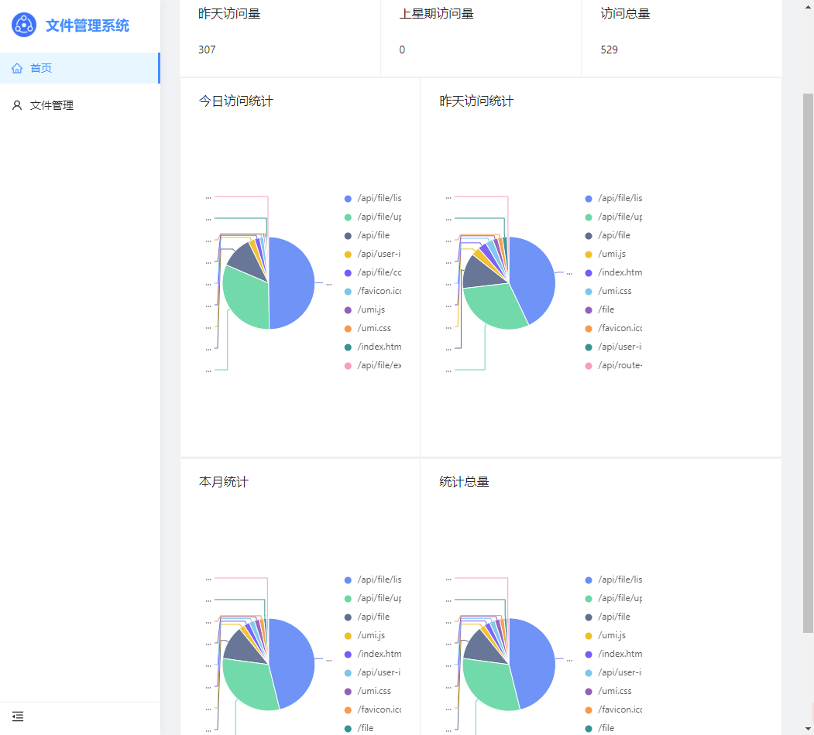
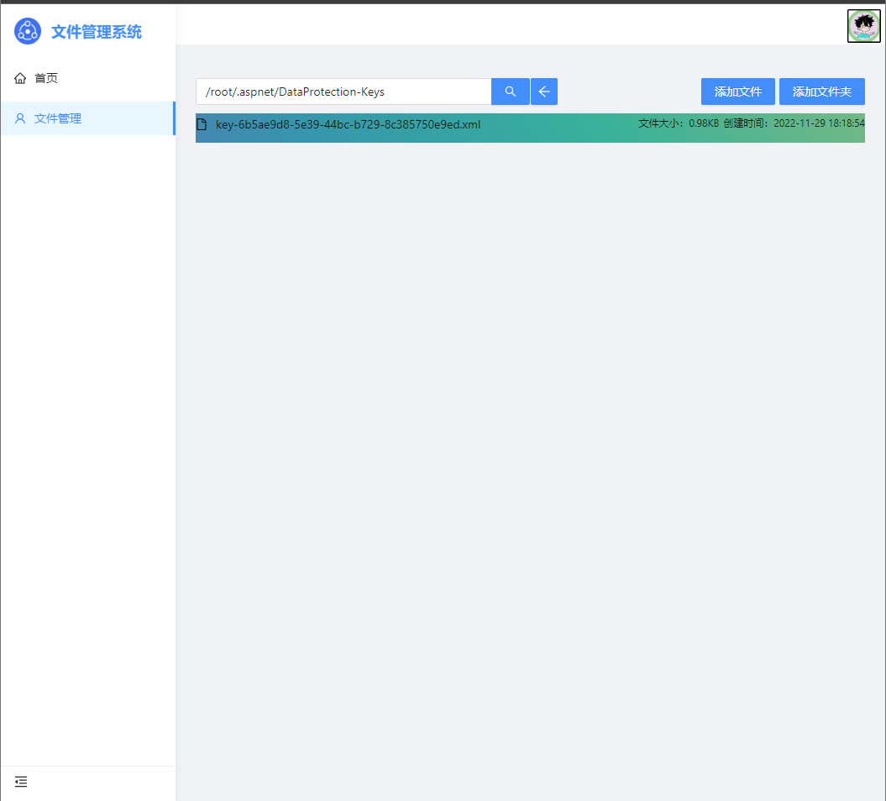
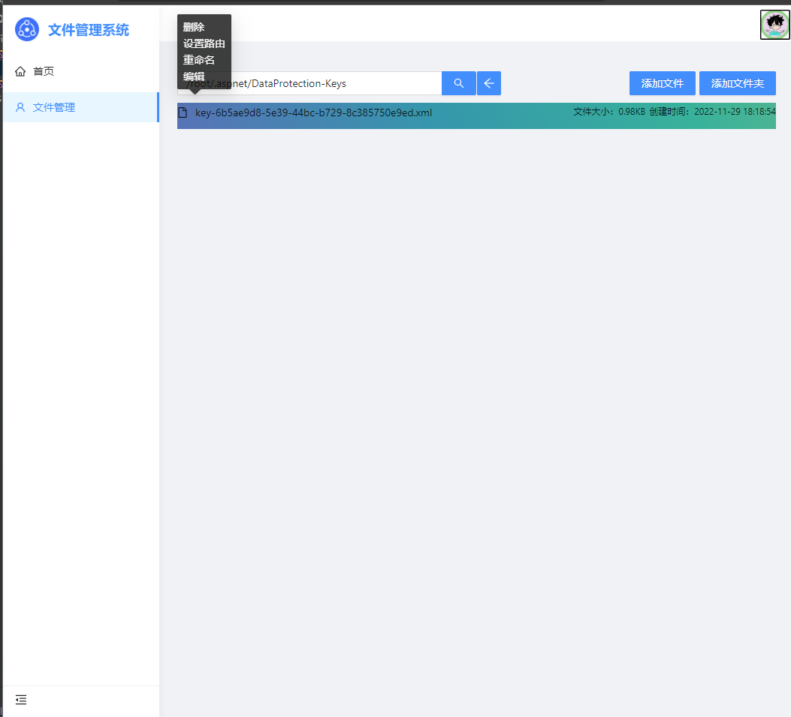

# .Net 文件管理系统

基于.Net 7实现的服务器文件管理系统

|      | 功能     | 描述                                                 |
| ---- | -------- | ---------------------------------------------------- |
| √  | 软链接   | 支持自定义软链接共外部网络访问文件，文件访问可控     |
| √ | 文件管理 | 支持管理服务器所有的文件，支持上传，下载，删除，编辑 |
| √ | 访问统计 | 支持统计接口访问量统计                               |

# 项目展示：

